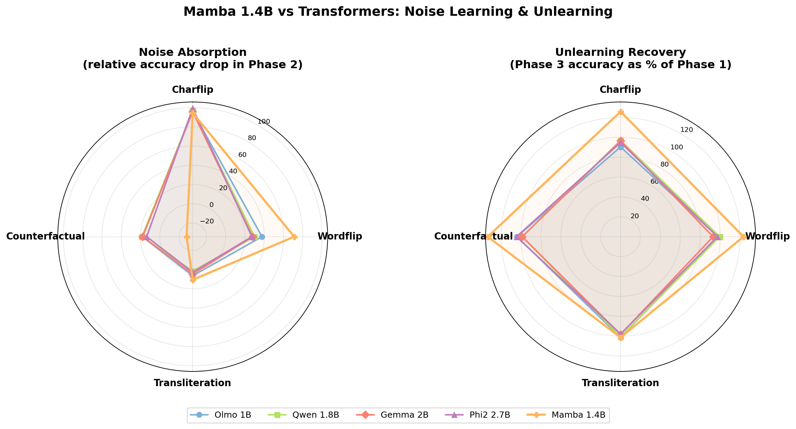

# Can Mamba Learn, Unlearn, and Retain Noise? Extending the SLM Noise Study to State Space Models

*Part of my research into SSM architectures — documenting experiments extending transformer noise robustness studies to Mamba*

---

## The Question That Started This

Can a state space model handle noise the same way a transformer does?

I'd been reading [*Can Small Language Models Learn, Unlearn, and Retain Noise Patterns?*](https://arxiv.org/abs/2407.00996) — a paper that puts four instruction-tuned transformers (Olmo, Qwen, Gemma, Phi2) through a three-phase stress test: finetune on clean QA data, train on noisy data, then retrain on clean data. The results are clean — transformers absorb noise, and clean retraining mostly undoes the damage.

But nobody tested SSMs. Mamba processes sequences through a compressed recurrent state instead of attention. No key-value lookups, no position-independent token access. I wanted to know: does that fundamentally change how noise gets absorbed and released?

**I expected Mamba to behave roughly like the transformers, maybe with some quantitative differences.** I was wrong in interesting ways.

---

## The Setup

### Three-Phase Pipeline

Same protocol as the paper:

1. **Phase 1 (Finetune):** Train on clean SQuAD data to establish baseline QA accuracy
2. **Phase 2 (Noise Train):** Continue training on noise-corrupted answers
3. **Phase 3 (Unlearn):** Retrain on clean data — see how much recovers

### Four Noise Types

Each targets a different linguistic level:

- **Charflip:** Random character substitutions ("Paris" → "Pxris")
- **Wordflip:** Word permutations ("the capital city" → "city the capital")
- **Transliteration:** Roman → Devanagari script conversion
- **Counterfactual:** Replace correct answers with plausible wrong ones

### Training Config

Matched the paper's Appendix C: LR 3e-6, AdamW (betas 0.9/0.95), cosine schedule, 100 warmup steps, bf16, 5 epochs per phase. Batch size 2 (paper doesn't specify theirs).

---

## Where My Setup Differs From the Paper

I want to be upfront about this because it affects everything.

**Evaluation method.** The paper uses Gemma-based LLM judging — more lenient with paraphrased answers. I use fuzzy string matching, which is stricter. My accuracy numbers are deflated across the board.

**Base model vs. instruction-tuned.** This is the big one. Mamba-1.4B is a *base* language model. No instruction tuning. The paper's models are all instruction-tuned — they already know how to follow instructions and format answers before the experiment even starts. Mamba has to learn all of that from scratch during Phase 1. This is why Mamba's baseline is **29.4%** while the transformers sit at **72–96%**.

**Architecture.** Mamba 1.4B sits between Olmo 1B and Qwen 1.8B in parameter count, but SSM vs Transformer makes direct size comparison meaningless. Different architectures, different information processing.

---

## Results

### The Full Picture

| Model | Arch | Charflip P1 | Charflip P2 | Charflip P3 | Wordflip P1 | Wordflip P2 | Wordflip P3 | Translit P1 | Translit P2 | Translit P3 | Counter P1 | Counter P2 | Counter P3 |
|-------|------|-------------|-------------|-------------|-------------|-------------|-------------|-------------|-------------|-------------|------------|------------|------------|
| Olmo 1B | Transformer | 72.2 | 2.7 | 65.2 | 72.2 | 45.0 | 70.4 | 72.2 | 67.6 | 73.1 | 39.8 | 32.6 | 41.4 |
| Qwen 1.8B | Transformer | 82.3 | 2.5 | 79.7 | 82.3 | 57.7 | 81.9 | 82.3 | 81.1 | 82.7 | 66.5 | 54.2 | 65.7 |
| Gemma 2B | Transformer | 89.1 | 3.8 | 85.9 | 89.1 | 64.1 | 82.8 | 89.1 | 85.0 | 87.5 | 49.6 | 40.8 | 49.0 |
| Phi2 2.7B | Transformer | 95.7 | 0.5 | 90.7 | 95.7 | 69.7 | 93.1 | 95.7 | 93.2 | 93.6 | 66.5 | 57.5 | 69.5 |
| **Mamba 1.4B** | **SSM** | **29.4** | **1.6** | **37.0** | **29.4** | **8.5** | **36.3** | **29.4** | **26.3** | **29.8** | **29.4** | **37.6** | **39.2** |

All values are D_ad_train accuracy (%).

### Noise Absorption (Relative Accuracy Drop in Phase 2)

How much did accuracy drop when noise was introduced? Higher = more absorbed.

| Model | Charflip | Wordflip | Transliteration | Counterfactual |
|-------|----------|----------|-----------------|----------------|
| Olmo 1B | 96.3% | 37.7% | 6.4% | 18.1% |
| Qwen 1.8B | 97.0% | 29.9% | 1.5% | 18.5% |
| Gemma 2B | 95.7% | 28.1% | 4.6% | 17.7% |
| Phi2 2.7B | 99.5% | 27.2% | 2.6% | 13.5% |
| **Mamba 1.4B** | **94.6%** | **71.1%** | **10.5%** | **-27.9%** |

That negative counterfactual value? Mamba's accuracy *went up* during noise training. More on that below.

### Unlearning Recovery (Phase 3 as % of Phase 1)

How much accuracy was recovered after clean retraining?

| Model | Charflip | Wordflip | Transliteration | Counterfactual |
|-------|----------|----------|-----------------|----------------|
| Olmo 1B | 90.3% | 97.5% | 101.2% | 104.0% |
| Qwen 1.8B | 96.8% | 99.5% | 100.5% | 98.8% |
| Gemma 2B | 96.4% | 92.9% | 98.2% | 98.8% |
| Phi2 2.7B | 94.8% | 97.3% | 97.8% | 104.5% |
| **Mamba 1.4B** | **125.9%** | **123.5%** | **101.4%** | **133.3%** |

Values >100% mean Phase 3 *exceeded* Phase 1. Mamba does this consistently. The transformers never do.

---

## What I Found

### Charflip: Same Absorption, Completely Different Failure

I expected Mamba to absorb charflip similarly to transformers. It did — **94.6%** relative drop, right in the transformer range (95–99%).

But the *way* it failed was nothing like transformers.

After charflip training, transformers produce char-flipped text that resembles the noisy training data. Mamba instead produced degenerate repetitive outputs — strings like `.sagitare .sagitare .sagitare...` over and over.

**It didn't learn the noise pattern. It lost the ability to generate coherent text entirely.**

This suggests character-level corruption doesn't teach Mamba a new pattern — it destroys the recurrent state's ability to maintain coherent generation. The SSM's compressed hidden state might be more fragile to character-level noise than attention.

### Wordflip: Mamba Is Way More Vulnerable

This was the starkest difference.

```
Wordflip absorption (relative accuracy drop):
Transformers:  27-38%
Mamba:         71.1%
```

**Nearly double the impact.** Word-level permutation hits Mamba much harder than any transformer.

This makes architectural sense. Transformers can attend to any token regardless of position — word reordering doesn't fundamentally change what attention can access. SSMs process left-to-right through a compressed state. Word reordering changes what information is available in the hidden state at each step. The sequential compression is more sensitive to word order than parallel attention.

### Transliteration: Nobody Cares

Both architectures mostly shrug this off.

```
Transliteration absorption:
Mamba:        10.5%  (29.4 → 26.3)
Transformers:  1.5-6.4%
```

Script changes don't meaningfully disrupt either architecture. The slightly larger Mamba drop could be noise, or could reflect the base model's weaker grasp of answer formatting. Either way — not interesting.

### Counterfactual: This One Surprised Me

I expected counterfactual noise to hurt Mamba like it hurts transformers. Instead:

```
Mamba counterfactual trajectory:
Phase 1: 29.4%  →  Phase 2: 37.6%  →  Phase 3: 39.2%

Accuracy went UP through the entire experiment.
```

**The counterfactual data wasn't noise for Mamba. It was a free tutorial.**

The "wrong" answers are syntactically and semantically well-formed — they're just factually incorrect. For instruction-tuned transformers that already know how to answer questions, this is pure corruption. For a base model still learning how to do QA at all, these well-formed answers teach answer formatting and extraction patterns even though the content is wrong.

This was the result I least expected. It reframes what "noise" even means — it's relative to what the model already knows.

### Unlearning: Mamba Overshoots Every Time

The most consistent pattern across all noise types:

```
Phase 3 vs Phase 1 (Mamba):
Charflip:       37.0% vs 29.4%  (+25.9%)
Wordflip:       36.3% vs 29.4%  (+23.5%)
Transliteration: 29.8% vs 29.4%  (+1.4%)
Counterfactual:  39.2% vs 29.4%  (+33.3%)
```

**Phase 3 accuracy exceeds Phase 1 in almost every case.** Transformers recover *to* their baseline. Mamba blows past it.

The explanation is probably simple: Mamba's Phase 1 baseline is low (29.4%) because it's a base model doing 5 epochs of finetuning. It's still climbing the learning curve. Phases 2 and 3 each add 5 more epochs. Even if Phase 2 introduces garbage, Phase 3's clean data gives Mamba 10 additional epochs of QA-format training compared to Phase 1's 5. More training = better performance when you're starting from a low baseline.

The noise/unlearn framework assumes a saturated baseline. Instruction-tuned models provide that. Base models don't.

---

## The Radar Charts

Noise absorption (left) and unlearning recovery (right) across all four noise types. Mamba 1.4B in orange against the paper's four transformers.



*Left: Mamba's wordflip spike stands out — far more absorbed than any transformer. The counterfactual dip below zero is unique to Mamba. Right: Mamba's polygon extends well beyond the transformer cluster, reflecting >100% recovery across most noise types.*

---

## What Surprised Me

### 1. The Degenerate Outputs
I expected Mamba to learn charflip patterns like transformers do. Instead it produced repetitive garbage. The recurrent state appears more fragile to character-level corruption than I assumed.

### 2. Counterfactual As Training Signal
I didn't anticipate that "wrong" answers could be helpful. In retrospect it's obvious — a base model learning QA benefits from any well-formed answer examples — but I didn't see it coming.

### 3. The Unlearning Overshoot
I expected Phase 3 to recover *toward* Phase 1, not blow past it. This completely reframes the experiment — for a base model, the three-phase pipeline isn't "learn → damage → repair." It's "learn a little → learn more (with noise) → learn even more (clean)."

### 4. How Misleading Absolute Numbers Are
Mamba at 29.4% vs Phi2 at 95.7% looks like Mamba is terrible. It's not — it's a base model being compared to instruction-tuned models on an instruction-following task. The interesting story is in relative patterns, not absolute accuracy.

---

## Open Questions

### 1. What Would Instruction-Tuned Mamba Look Like?
If Mamba had instruction tuning, would the patterns look more like transformers? Would the unlearning overshoot disappear? Would counterfactual data become actual noise?

### 2. Is the Degenerate Output Problem SSM-Specific?
Would a base transformer also produce repetitive garbage under charflip, or is this unique to how SSMs maintain hidden state?

### 3. Does Wordflip Vulnerability Scale With Model Size?
Mamba-1.4B is much more wordflip-vulnerable than transformers. Would a larger Mamba (e.g., Mamba-2.8B) close the gap, or is this an architectural constant?

### 4. What's Happening Inside the State?
The recurrent hidden state is what makes Mamba different. Probing that state during noisy vs clean generation could reveal *why* word reordering is more disruptive to SSMs — similar to probing transformer attention patterns but for selective state space dynamics.

---

## Conclusion

Mamba handles noise differently from transformers. Not better, not worse — *differently*.

It's more vulnerable to word-level permutation. It absorbs character noise through degeneration rather than pattern learning. It treats counterfactual data as useful signal rather than corruption. And the "unlearning" framing doesn't quite apply — Mamba's low baseline means the noise→clean cycle is more like extended training than damage repair.

These results come with heavy caveats — base vs instruction-tuned, fuzzy matching vs LLM judging — so they're directional observations, not definitive architecture comparisons. A fairer test would use an instruction-tuned Mamba variant, or apply the same base-model treatment to the transformers.

But even with the caveats, the pattern differences are real. SSMs and transformers don't just differ in speed — they differ in how they absorb and release learned patterns.

---

## References

- Original Paper: [Can Small Language Models Learn, Unlearn, and Retain Noise Patterns?](https://arxiv.org/abs/2407.00996)
- Mamba Paper: [Mamba: Linear-Time Sequence Modeling with Selective State Spaces](https://arxiv.org/abs/2312.00752)
- [Full results and data](mamba/RESULTS.md)
